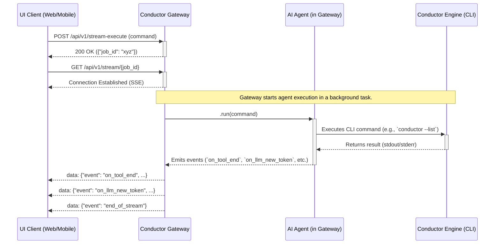

# Architecture Overview: Conductor Gateway

## 1. Purpose

The Conductor Gateway serves as a dedicated **Backend-for-Frontend (BFF)** for the Conductor ecosystem. Its primary role is to expose the powerful, command-line-based `conductor` engine through a modern, secure, and scalable API. It acts as the single, unified entry point for any user interface (web, mobile, or desktop) that needs to interact with Conductor agents.

## 2. Core Components

The gateway is built on a robust and decoupled architecture:

### a. FastAPI Application (`src/api/app.py`)

This is the main web server that exposes all HTTP endpoints. It handles:
-   REST endpoints for synchronous actions (e.g., `/health`, `/execute`).
-   Server-Sent Events (SSE) endpoints for real-time streaming.
-   CORS (Cross-Origin Resource Sharing) middleware to allow access from web clients.
-   Application lifecycle management.

### b. MCP Server (`src/server/advanced_server.py`)

This is a background worker server, based on the `FastMCP` library, that runs in a separate thread. Its sole responsibility is to expose the `conductor` engine's functionalities as a set of tools that can be called by an AI agent.

### c. Lifespan Management

The FastAPI application manages the lifecycle of the MCP Server. Using FastAPI's `lifespan` context manager:
-   **On Startup:** The MCP Server is initialized and started in a background daemon thread.
-   **On Shutdown:** The application shuts down gracefully.

This ensures that the tool server is always available as long as the API is running.

## 3. Request Flow (SSE Streaming)

The primary workflow for interacting with an agent is asynchronous and designed for real-time feedback.

## 4. Configuration System (`src/config/settings.py`)

The gateway uses a hybrid configuration system for maximum flexibility:
1.  **Base Configuration:** A `config.yaml` file in the root directory defines all default settings.
2.  **Environment Overrides:** Any setting can be overridden by setting a corresponding environment variable (e.g., `PORT` overrides `server.port`).

This allows for easy configuration in local development (via the YAML file) and seamless integration with production environments and CI/CD pipelines (via environment variables).

## 5. Directory Structure

The project follows a standard Python `src/` layout:
-   `src/`: Contains all the application's source code.
    -   `api/`: Defines the FastAPI application and its endpoints.
    -   `config/`: Handles the configuration loading.
    -   `server/`: Contains the MCP server implementation.
    -   `tools/`: Implements the tools that wrap the Conductor CLI.
    -   `utils/`: Contains internalized helper functions.
-   `tests/`: Contains unit and integration tests.
-   `docs/`: Project documentation.
-   `pyproject.toml`: Defines project metadata and dependencies using Poetry.
